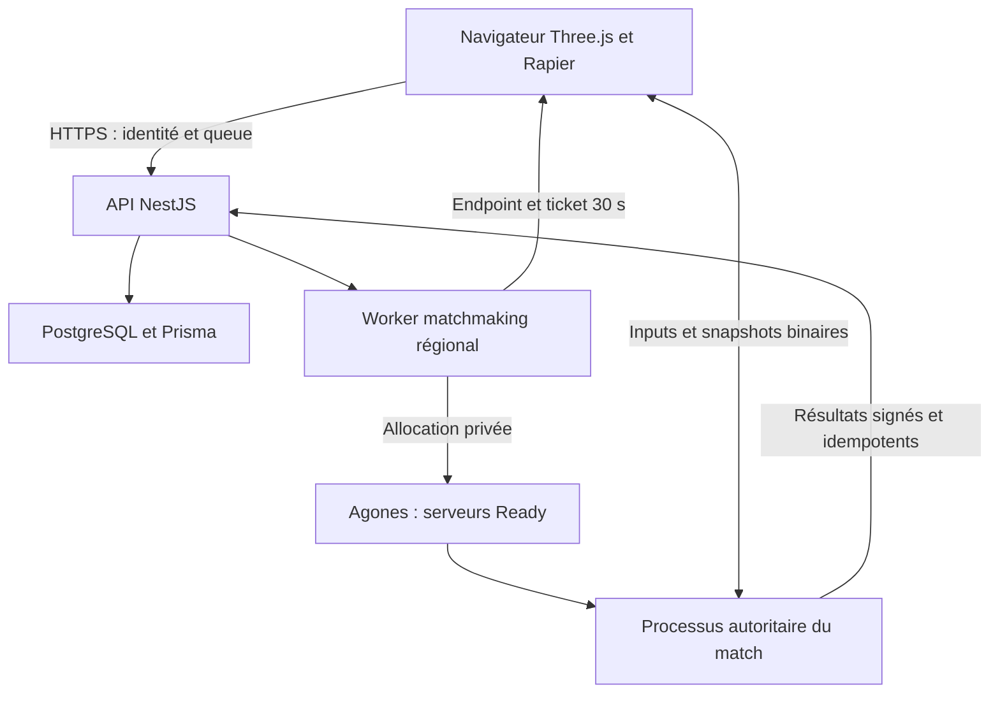

# Vortex architecture technique

Vortex vise une simulation autoritaire à 128 Hz et un rendu client à 144 FPS. Les valeurs sont
des objectifs de mesure, pas des garanties obtenues en choisissant un langage. La fondation
livrée permet de travailler les contrats réseau avant de produire les assets et les règles compétitives.

## Architecture et budgets

Le plan de données est séparé du plan de contrôle. Le processus de match ne fait aucune requête
SQL, OIDC ou matchmaking pendant ses ticks. Le navigateur ne reçoit jamais de secret serveur.

| Cadence | Choix initial | Budget ou contrainte |
| --- | --- | --- |
| Simulation | 128 Hz | 7,8125 ms par tick ; viser CPU p99 < 3 ms sous charge |
| Rendu | 144 Hz | 6,944 ms par frame ; viser GPU < 4 ms et CPU rendu < 2 ms |
| Inputs | 128 commandes/s, lots à 64 Hz | Deux commandes par envoi, délai de lot ≤ un tick |
| Snapshots | 32 Hz | Interpolation initiale de 50 ms, indépendante du tickrate |
| Rewind | 100 ms maximum | Politique compétitive explicite et identique pour tous |
| Historique | 32 poses à 128 Hz | 31 intervalles ≈ 242 ms disponibles |
| Match | 16 joueurs | Un processus par match, aucun DB I/O dans le tick |

La première implémentation utilise WebSocket : simple à déployer et à diagnostiquer, mais TCP
introduit un blocage en tête de file après perte. Pour l'objectif e-sport, comparer un transport
WebRTC DataChannel `ordered:false, maxRetransmits:0` pour inputs/snapshots, avec redondance
des dernières commandes et ACK. Un canal fiable séparé transporte admission, inventaire et fin
de partie. `ordered:false` seul ne supprime pas les retransmissions. SCTP/DTLS/ICE/TURN ont un
coût et des modes de congestion propres : mesurer sur mobile/Wi-Fi et avec TURN réellement utilisé.

L'autorité est le serveur dédié, jamais un pair joueur. Limiter la taille des datagrammes applicatifs
pour éviter la fragmentation (cible ≤ 1100 octets pour le transport UDP, à vérifier selon MTU).
WebSocket reste un repli pour les réseaux restrictifs. La démo ne prétend pas livrer ce transport WebRTC.

## Pilier A — Prédiction, réconciliation et interpolation

Le temps de simulation est `tick / tickrate`. La durée des commandes n'est pas un champ client :
chaque commande consommée représente exactement `dt = 1/128 s`. Le serveur consomme au maximum
une nouvelle commande par joueur et par tick. Une accélération frauduleuse de l'horloge client
remplit une queue bornée ou provoque une exclusion ; elle ne fait jamais avancer le monde plus vite.

Une commande est un désir (axes, angles, boutons), jamais une position, une vitesse, un dommage
ou un résultat de raycast. Le client quantifie d'abord la commande puis prédit avec la même
valeur quantifiée que le serveur. Prédire avec l'angle flottant puis transmettre un angle arrondi
créerait des divergences évitables.

### Prédiction locale

Pour un état `S_k`, une entrée canonique `u_k` et une fonction commune `F` :

`S_(k+1) = F(S_k, u_k, dt)`.

La capsule locale réagit immédiatement. Le serveur reçoit les inputs en arrière-plan. Le client
garde une fenêtre de 256 commandes, soit deux secondes, et exige une resynchronisation lorsqu'elle
est saturée. La boucle rAF ne décide pas de la fréquence physique. La caméra tourne au rythme du
rendu ; la translation rendue interpole les deux états locaux adjacents (au prix d'un tick de délai visuel).

Le replay se limite aux mouvements : rejouer les dommages, sons, achats ou effets de bouche
au passage d'un ACK est une erreur. Les événements prédits futurs doivent être indexés par
`(session, sequence, event-kind)` et dédupliqués.

### Réconciliation

Le snapshot autoritaire contient `ack`, position, vitesse, grounded, crouched, slideTicks,
lastButtons et epoch. Position seule serait insuffisante : une différence de friction, d'état
de saut ou de stance re-divergerait au tick suivant.

À réception de l'ACK `a` : restaurer l'état autoritaire `S_a`, supprimer les commandes `seq <= a`
avec comparaison modulo 2^32, rejouer les commandes restantes dans l'ordre, puis corriger
seulement la représentation visuelle. La position de collision est corrigée immédiatement.

La correction visuelle décroît selon `e(t+dt) = e(t) exp(-dt / tau)`, `tau = 45 ms`. Une erreur
supérieure à 1,5 m ou un changement d'epoch provoque un snap. Ne pas lisser le collider à travers
un mur pour rendre une correction jolie. Les plateformes mobiles, objets dynamiques et collisions
entre joueurs nécessiteraient aussi leur état de simulation historique dans le replay. La base
utilise une carte statique et filtre les autres joueurs du mouvement, ce qui rend la restauration locale explicite.

### Interpolation des adversaires

Afficher les adversaires à `T_render = T_server_estime - I`, ici `I = 50 ms`. Avec deux snapshots
`S0, S1` à `t0 <= T_render <= t1` :

`alpha = (T_render - t0)/(t1 - t0)` et `p = p0 + alpha (p1 - p0)`.

Les rotations prennent l'arc le plus court ; un epoch différent interdit de tracer une trajectoire
entre une mort et une réapparition. La base utilise une interpolation linéaire et gèle au dernier
état disponible si le tampon manque. Une Hermite utilisant les vitesses peut être plus agréable,
mais doit être bornée car elle peut dépasser un obstacle entre deux poses. Une extrapolation
éventuelle est limitée à 25–50 ms puis gelée, jamais prolongée arbitrairement.

L'interpolation adaptative doit être négociée et plafonnée côté serveur. Un client ne peut pas
déclarer « j'interpole sur 300 ms » pour obtenir 300 ms de rewind. La démo utilise la valeur fixe
50 ms côté client et serveur. Un service de temps de production utilise quatre timestamps :

`RTT = (c4 - c1) - (s3 - s2)` ; `offset = ((s2 - c1) + (s3 - c4)) / 2`.

Retenir une enveloppe des meilleurs échantillons, borner les sauts d'offset et l'évolution de la
fréquence. Ces formules supposent un trajet suffisamment symétrique ; elles ne prouvent pas la
latence aller exacte. `RenderClock` livré est un estimateur de départ basé sur les arrivées et le RTT.

## Pilier B — Compensation de latence

La compensation hitscan est une requête historique autoritaire. Elle ne doit pas être confondue
avec le rollback complet d'un jeu de combat, qui ré-exécute une simulation après une entrée tardive.

Au moment où le serveur traite le tir :

`age = min(W_max, RTT_mesure / 2 + I_approuve + Q_serveur)`

`T_target = T_now - age`.

`Q_serveur` inclut le temps d'attente dans la queue d'inputs après réception. Omettre l'interpolation
est une erreur fréquente : le tireur visait un adversaire déjà affiché dans le passé. Avec RTT 20 ms,
I 50 ms et Q 8 ms, la cible est interrogée 68 ms dans le passé. Un RTT de 400 ms ne donne jamais
250 ms de privilège : le plafond global reste 100 ms et l'excédent n'est pas compensé.

La fondation utilise un RTT obtenu par challenge ping/pong serveur avec un nonce imprévisible et
le quartile inférieur de la fenêtre. Cela limite l'inflation ponctuelle ; cela ne rend pas un client
incapable de retarder tous ses paquets. Le seul contrôle robuste du privilège est un budget dur,
un filtre temporel, les délais de commandes et une admission régionale stricte.

Le champ client `phase` ne donne aucun droit de rewind. Pour de vrais tirs subtick, conserver
des ancres `(sequence, serverTick)` et accepter un offset de phase borné dans l'intervalle de la
commande, vérifié contre le rythme, la synchronisation et le temps d'arrivée. La démo n'applique
pas une précision subtick et n'accepte aucun timestamp de tir arbitraire. Son estimation a une
erreur liée à l'asymétrie réseau et à l'envoi par lots. Ce contrat devra être remplacé par les ancres
avant une qualification compétitive à haute précision.

### Historique et requêtes

Le serveur archive des hitboxes, pas tout Rapier : `(id, epoch, alive, position, capsule, time)`.
Les coordonnées sont interpolées entre deux poses historiques ; la taille de stance utilise le
dernier état discret valide. Une collision à `T_target` ne modifie jamais les bodies vivants.
Cela évite les races « déplacer, tirer, restaurer » entre deux tirs et rend les queries parallélisables.

Les hitboxes doivent inclure tous les occluders mobiles lorsqu'ils seront introduits : portes,
plateformes, boucliers. Utiliser un historique joueur avec une porte actuelle serait incohérent.
La carte de la démo est entièrement statique ; ses raycasts utilisent donc les mêmes boîtes à
toutes les époques. Le tir est arrêté par le premier obstacle statique ou la première hitbox valide.

L'origine de tir provient de la pose autoritaire produite pour la commande du tireur. Le client
ne transmet aucune origine. La direction vient des angles reçus et du recul calculé par le serveur.
Le raycast teste la capsule historique de la cible. Avant dommage, vérifier que l'epoch historique
correspond encore à l'epoch vivant : un tir tardif ne doit pas tuer la nouvelle incarnation.

Pour une sphère de centre `C`, rayon `r`, rayon `O+tD`, `|D|=1`, avec `q=O-C` :

`b = q·D`, `c = q·q - r²`, `discriminant = b²-c`, `t_near = -b-sqrt(discriminant)`.

Une capsule verticale est l'union du cylindre fini et des deux sphères aux extrémités. Le
cylindre résout `(Dx²+Dz²)t² + 2(qxDx+qzDz)t + (qx²+qz²-r²) = 0` et rejette les solutions
hors du segment vertical. L'algorithme prend le plus petit t non négatif, puis applique portée
et couvert. Les cas tangents, départ intérieur et rayons axiaux sont testés.

### Équité

Il est impossible de garantir à la fois « le tireur touche toujours ce qu'il voyait » et « un
joueur derrière un couvert ne reçoit jamais un ancien tir ». Ce conflit est temporel. Le bon
contrat est explicite : compensation de 100 ms maximum, interpolation minimale stable,
plafond de RTT en ranked, historique des occluders, télémétrie des tirs après couvert et règles
de trade kill définies. Le rewind ne diminue pas le RTT d'un joueur lointain.

La démo traite les tirs séquentiellement dans un tick : elle ne livre pas encore une politique
de trade kill simultané. Pour la production, collecter les intents, vérifier les tirs contre
l'historique commun, puis appliquer un journal de dommages selon la règle de compétition choisie.

Les projectiles évoluent dans le monde actuel et utilisent des segments balayés pour empêcher
le tunneling. Ils ne reprennent pas automatiquement la politique hitscan. Un rattrapage de spawn
historique doit être plafonné et simuler les obstacles/cibles sur tout son intervalle. Le projectile
de base est un point rapide à dommage direct ; un volume et des cibles se déplaçant pendant le
tick exigent des shape casts et une collision relative, puis une réplication visuelle dédiée.

## Pilier C — Sérialisation

Input ABI v1, little-endian, exactement 12 octets :

| Offset | Type | Valeur |
| --- | --- | --- |
| 0 | uint32 | séquence |
| 4 | uint16 | yaw, un tour sur 65536 valeurs |
| 6 | int16 | pitch de -pi/2 à +pi/2, -32768 interdit |
| 8 | uint8 | forward/back/left/right/jump/slide/fire |
| 9 | uint8 | arme 0 ou 1 |
| 10 | uint16 | phase de sampling réservée au futur subtick |

`yaw_step = 360°/65536 ≈ 0,00549°`. Le pitch a une résolution voisine de `180°/65534`.
À 128 commandes/s, le corps des inputs utilise 1536 octets/s. L'en-tête de lot de 4 octets
à 64 Hz ajoute 256 octets/s : **1792 octets/s de payload**, avant WebSocket, TCP/IP et TLS.
Le framing WebSocket client avec mask ajoute également des octets ; la taille binaire ne permet
pas d'annoncer le débit filaire sans compter le transport.

L'en-tête contient type, version, count et reserved. Le parser exige une longueur exacte,
compte entre 1 et 8, zéro pour reserved, flags connus et arme valide. Les vues avec byteOffset
non nul sont testées. La queue serveur contient au maximum 16 commandes ; une token bucket
borne le débit. Pour WS fiable, les séquences doivent être contiguës. Pour WebRTC non fiable,
conserver un bitmap de réception et dédupliquer les inputs redondants ; le parser actuel ne
peut pas être branché tel quel sur un canal avec pertes.

Les snapshots utilisent FlatBuffers (`snapshot.fbs`) ; le binding minimal livré écrit et lit les
tables via le runtime officiel. Ajouter des champs en respectant l'évolution du schéma et
générer les bindings des langages nécessaires avec flatc. Un FlatBuffer n'est pas toujours plus
petit qu'un ABI struct fixe : les tables ont des offsets et vtables. Il est adapté à l'évolution
des snapshots ; le format compact d'input reste volontairement fixe.

Le snapshot initial envoie tous les joueurs. Pour la production : AoI, quantification de poses,
champs publics séparés de l'état privé, deltas par rapport à une baseline **ACKée**, keyframes
périodiques, événements fiables de spawn/despawn, et limites de fragmentation. Une baseline
simplement envoyée ne suffit pas : elle peut être absente du client en transport non fiable.
Ne jamais supprimer un obstacle du monde de collision parce qu'il est hors du champ visuel.

Le reader FlatBuffers JS n'est pas un verifier de buffers hostiles. Le serveur n'utilise pas ce
reader sur l'ingress client : il utilise uniquement l'ABI fixe strict. Si des buffers FlatBuffers
clients sont introduits, ajouter un verifier adapté et des bornes sur chaque offset/vector.

## Pilier D — Contrôleur Rapier et accélération Quake/Source

Rapier résout le sweep/collision d'une capsule. Le jeu décide de la vitesse, de la gravité, du
saut et de la friction. Un body dynamique avec friction physique standard ne donne pas ce
contrôle de movement shooter. La base utilise un collider sans parent contrôlé par le KCC,
pas une translation de mesh Three.js qui traverserait la scène.

Pour la vitesse horizontale `v`, la direction normalisée souhaitée `w`, le plafond de projection
`c`, la vitesse de référence `W`, l'accélération `a` et le tick `dt` :

`p = v·w`

`add = max(0, c-p)`

`delta = min(add, a W dt)`

`v' = v + delta w`.

Au sol `c=W=8 m/s`, `a=14 s^-1`. En l'air `W=8 m/s`, `c=1,2 m/s`, `a=12 s^-1`.
Ces paramètres sont un tuning Vortex inspiré de la projection Quake/Source, pas une affirmation
que tous les jeux Source et Quake utilisent exactement les mêmes paramètres. Certaines variantes
utilisent la vitesse plafonnée dans le terme d'accélération ; d'autres utilisent la vitesse de
référence non plafonnée. Choisir et versionner le comportement plutôt que copier involontairement un bug historique.

Le mécanisme de gain est explicite :

`|v'|² - |v|² = 2 delta (v·w) + delta²`.

Si `v` est long mais `w` lui est presque perpendiculaire, `v·w` reste inférieur au cap et on peut
ajouter de la vitesse. **Clamper |v| à W détruirait ce mécanisme.** Pour une accélération complète
`A=aWdt`, la frontière est `cos(theta)=(c-A)/|v|` lorsque `A<=c`, avec theta l'angle entre v et w.
Tourner la caméra maintient la wish direction près de cette frontière. La base impose séparément
une limite de sécurité de 40 m/s pour borner les exploits et le coût des déplacements.

La friction au sol est :

`speed' = max(0, speed - max(speed, stopSpeed) friction dt)`.

Un saut valide avant friction conserve l'impulsion horizontale. Le saut maintenu permet le
bunny hopping continu. Une nouvelle pression sur le tick grounded ajoute 0,25 m/s dans la
direction de la vitesse ; maintenir Espace ne déclenche pas ce bonus. « À la frame près » ne
peut pas dépendre du framerate variable des machines : la règle compétitive utilise le tick
de simulation. Un bonus subtick exigerait un sampling temporel validé, pas un compteur rAF.

Le slide réduit la friction pour 64 ticks maximum et exige >6 m/s. Le crouch conserve la
position des pieds lors du changement de capsule. Avant de se relever, tester le volume debout
pour interdire l'expansion à travers un plafond. Les vitesses sont clippées contre les normales
de collision (`v -= min(v·n,0)n`) pour éviter d'accumuler une vitesse vers le mur/plafond.
Le snap au sol est désactivé pendant la montée d'un saut.

La caméra Three.js lit une pose rendue et une hauteur d'œil ; elle ne fait jamais autorité sur
la capsule. Les slopes, stairs, edge cases et changements de stance doivent être validés avec
des tests d'intégration sur la version Rapier retenue avant de figer les cartes compétitives.

### Déterminisme

Rapier WASM annonce un déterminisme multiplateforme à initialisation, version, paramètres et
ordre de création identiques. Cela ne certifie pas automatiquement toute la fonction de jeu :
la documentation souligne que `Math.sin` et `Math.cos` peuvent différer entre plateformes.
Le contrôleur livré utilise ces fonctions JS et des états réseau en float32 ; on ne revendique
donc pas un replay bit-identique de bout en bout entre tous les navigateurs.

Pour le verrouillage compétitif, déplacer trigonométrie et calculs de movement dans un noyau
WASM commun ou une table numérique committée, versionner/hash-er la simulation et les assets,
et tester des traces binaires de commandes sur Chrome, Firefox, Safari, x86 et ARM. Un serveur
Rust natif doit activer le déterminisme approprié de Rapier et partager les mêmes opérations ;
la présence de Rapier des deux côtés ne prouve pas à elle seule l'égalité native/WASM.
La réconciliation reste nécessaire même avec un moteur déterministe : inputs absents et monde
connu différemment suffisent à créer des divergences.

## Pilier E — Infrastructure et matchmaking mondial

Une cible de RTT inférieur à 30 ms nécessite plusieurs régions et du peering de qualité.
Paris, Francfort et Londres en Europe ; Ashburn, Chicago/Dallas et Los Angeles en Amérique du Nord
sont des **candidats à mesurer**, pas des promesses géographiques. L'ISP, le Wi-Fi, le dernier
kilomètre et les détours BGP peuvent dépasser le budget malgré une région proche.
Un même match Europe–côte Ouest américaine ne peut pas garantir 30 ms à tous les participants.

Le navigateur mesure des endpoints QoS représentatifs du chemin jeu. Des probes HTTP sur un
CDN global mesureraient surtout le PoP CDN, pas le serveur cible. Utiliser une voie WS régionale
ou un DataChannel vers la région, plusieurs challenges courts, et comparer p50/p95/jitter/loss.
Les rapports servent au placement ; les mesures autoritaires du match servent au rewind.

Choisir une région commune éligible qui minimise d'abord le pire RTT du groupe :

`r* = argmin_r max_i RTT(i,r)` sous `forall i, RTT(i,r)<=30 ms` et capacité disponible.

Si aucune région n'est éligible, séparer les files ou demander un compromis de ping. Ne pas
élargir silencieusement le RTT en ranked. L'élargissement du MMR peut croître avec l'attente
(`50 + 5 points/s`, borné à 300 dans l'exemple) ; la latence suit une politique indépendante.
Une file globale ne signifie pas que les matchs ignorent les régions.

### Orchestration

1. Authentifier via OIDC ; résoudre le compte côté API ; lire MMR depuis PostgreSQL.
2. Enregistrer la queue ; conserver party, playlist, version de build, plateforme et observations QoS.
3. Un worker unique par groupe de tickets acquiert une lease transactionnelle.
4. Former un groupe compatible en MMR et sélectionner une région admissible.
5. Allouer atomiquement un serveur Ready de la Fleet de ce build via GameServerAllocation ou
   le service Agones Allocator privé en mTLS. L'endpoint Kubernetes de l'exemple exige ses credentials privés.
6. Le buffer Ready est reconstitué par FleetAutoscaler ; le provisionnement des nodes est
   assuré séparément par Cluster Autoscaler/Karpenter, avec de la réserve en amont.
7. Enregistrer l'association match/serveur, émettre pour chaque participant un ticket HMAC
   30 secondes, à usage unique, dont `match` correspond au `gameServerName` accepté par le serveur.
8. Le navigateur présente le ticket dans la première frame après WSS, pas dans l'URL journalisée.
9. Le proxy régional route vers l'IP/port alloué à partir d'un identifiant public de session dans
   le hostname ou le chemin, puis réécrit ce chemin en `/play`. Le ticket d'admission reste dans
   la première frame ; le routage ne dépend pas de sa lecture après l'upgrade. Un accès direct au hostPort TCP est suffisant
   en test local, mais ne fournit pas TLS au navigateur en production.
10. Le serveur appelle Ready après chargement/collision/écoute réseau, Health périodiquement,
    et Shutdown à la fin. Un résultat signé passe par une outbox/queue hors du tick ; la transaction
    de résultats et ledger est idempotente. Puis le match ne se réutilise pas sans reset complet.

Un timeout d'allocation est un état **inconnu**, pas la preuve d'un échec. Ne pas relancer
aveuglément un POST : deux serveurs pourraient être réservés. Réconcilier les GameServers
par le label `vortex.dev/match` sous la lease, puis décider. Ne pas compter sur GameServerAllocation
comme ledger durable de l'idempotence. Le worker complet et sa reprise après crash restent à réaliser.

Pour un match 1v1, le calcul Elo est `E_a=1/(1+10^((R_b-R_a)/400))`,
`R'_a=R_a+round(K(S_a-E_a))`, `R'_b=R_b-delta`. La fonction pure est livrée. Pour les équipes
et l'incertitude, préférer un modèle de rating adapté (et l'étalonner) plutôt qu'inventer une
mise à jour Elo joueur par joueur. Écrire le résultat et l'événement d'économie dans une
transaction sérialisable avec identifiant unique `(match,user)` et `eventId`, et retries bornés
des conflits. Les clients ne soumettent jamais leurs propres résultats récompensés.

### Exploitation et performance

Un processus par match facilite le budget CPU et la séparation des pannes. Pour obtenir un
cœur dédié en Kubernetes, configurer CPU Manager static, requests=limits entiers et QoS
Guaranteed pour **tous les containers du pod**, sidecar Agones compris. Le YAML d'exemple seul
ne garantit pas le pinning et les limites CPU peuvent créer du throttling : mesurer les périodes
de throttling. Les matches alloués ne sont pas des pods HTTP stateless à recycler pendant une partie.

Déployer blue/green par build ; allouer les nouveaux matchs au nouveau build puis drainer les
anciens. Une panne de node interrompt le match si aucun failover de simulation stateful n'est
implémenté. Ne pas promettre un failover seamless grâce à Kubernetes seul. En ranked, appliquer
une règle d'annulation/reprise et éviter de retirer injustement du MMR.

Instrumenter durée des ticks, dépassements, pauses GC, taille des snapshots, egress, RTT,
corrections, queue age, age réel des tirs, manque d'historique, quota d'admission et buffer Ready.
Le serveur d'exemple limite son rattrapage à quatre ticks par itération et se termine si son
retard dépasse 250 ms ; il ne laisse pas la queue de simulation croître sans borne.

Le client blockout utilise un InstancedMesh pour la carte, aucune shadow map, une limite DPR
de 1,5 et des matériaux simples. Une vraie cible 144 FPS exige un profil matériel défini,
profilage CPU/GPU, occlusion/LOD, budgets draw calls et allocations, options de qualité et
stress tests. Le tick de 128 Hz n'impose pas que le rendu soit également 128 Hz.

## Sécurité et conditions de publication

L'autorité serveur protège les règles, pas toute la perception. Un navigateur ne peut pas garder
secrètes des positions qui lui sont transmises ; ni ce code ni Rust n'éliminent les aimbots.
Limiter la réplication par intérêt/visibilité là où le gameplay le permet, protéger l'admission,
analyser les traces de visée et prévoir arbitrage/sanctions. Ne pas prétendre détecter un aimbot
avec un simple plafond de vitesse de rotation qui bloquerait des joueurs légitimes.

Les protections livrées incluent secret obligatoire hors localhost, Origin allowlist, TTL ticket,
scope de match, signature constant-time, nonce de replay, taille max de frame, compte max de
joueurs, séquences contiguës, token bucket, queue bornée, cadence/munition/recul serveur, portée,
couvert, epoch de respawn et backpressure. La protection DDoS doit être à l'edge régional ; une
Map IP en processus ne remplace pas un anti-DDoS. Remplacer le secret partagé global par clés
par région et rotation contrôlée, ou signatures asymétriques pour limiter la capacité de minting.

Avant exposition : installer/verrouiller les dépendances, compiler, valider Rapier/FlatBuffers,
tester les signatures OIDC, configurer TLS/routing/mTLS/RBAC, implémenter le worker et les
résultats idempotents, ajouter replay des commandes par tick, tests réseau et profiling 16 joueurs.
L'infrastructure fournie est un modèle de déploiement, pas un cluster déjà provisionné.

## Sources primaires

- Rapier : déterminisme et contraintes d'initialisation, https://rapier.rs/docs/user_guides/javascript/determinism/
- Rapier : Character Controller, https://rapier.rs/docs/user_guides/javascript/character_controller/
- Rapier : API KCC et normales, https://rapier.rs/javascript3d/classes/KinematicCharacterController.html
- id Software : formule d'accélération dans Quake III, https://github.com/id-Software/Quake-III-Arena/blob/master/code/game/bg_pmove.c
- W3C : Data Channels WebRTC, https://www.w3.org/TR/webrtc/
- Google FlatBuffers : schémas, tables et bindings, https://flatbuffers.dev/tutorial/
- Agones : allocation, https://agones.dev/site/docs/reference/gameserverallocation/
- Agones : FleetAutoscaler, https://agones.dev/site/docs/reference/fleetautoscaler/
- Agones : sidecar REST et retry au démarrage, https://agones.dev/site/docs/guides/client-sdks/rest/
- Agones : Allocator mTLS, https://agones.dev/site/docs/advanced/allocator-service/
- NestJS : authentification, https://docs.nestjs.com/security/authentication
- jose : vérification JWT/JWKS, https://github.com/panva/jose
